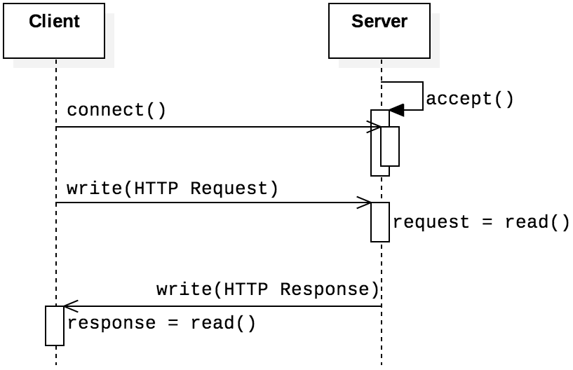

# Webserv

## HTTP

HTTP is the protocol that defines communication for web browsers and servers.  HTTP is a simple **[request-response protocol](https://w3.cs.jmu.edu/kirkpams/OpenCSF/Books/csf/html/Glossary.html#term-request-response-protocol)**, defined in RFC 2616. To be precise, HTTP is a **[stateless protocol](https://w3.cs.jmu.edu/kirkpams/OpenCSF/Books/csf/html/Glossary.html#term-stateless-protocol)**,  in the sense that neither the client nor the server preserves any state information between requests; the server processes each request independently from those that arrived previously. HTTP applications use TCP connections for their transport layer, and below figure shows the basic structure of HTTP in relation to the functions that establish the socket connection. The client—a web browser—sends an HTTP request to the server and receives a response.

**[Figure source](https://w3.cs.jmu.edu/kirkpams/OpenCSF/Books/csf/html/TCPSockets.html#tcphttp)** 

**HTTP is the foundation of data communication for the [World Wide Web](https://en.wikipedia.org/wiki/World_Wide_Web), where [hypertext](https://en.wikipedia.org/wiki/Hypertext) documents include [hyperlinks](https://en.wikipedia.org/wiki/Hyperlink) to other resources that the user can easily access, for example by a [mouse](https://en.wikipedia.org/wiki/Computer_mouse) click or by tapping the screen in a web browser.**

Development of HTTP was initiated by [Tim Berners-Lee](https://en.wikipedia.org/wiki/Tim_Berners-Lee) at [CERN](https://en.wikipedia.org/wiki/CERN) in 1989 and summarized in a simple document describing the behavior of a client and a server using the first HTTP version, named 0.9.[wiki](https://en.wikipedia.org/wiki/HTTP#cite_note-HTTP/0.9-specifications-2) That version was subsequently developed, eventually becoming the public 1.0

---

<!-- [*HTTP  Persistent Connections*](assets/HTTP%20Persistent%20Connections%2050ac7d397e6f473fbcd5b0a09e44622e.md) -->

<!-- [HTTP message format](assets/HTTP%20message%20format%20c2ce162ffbf84ddaa4687c0baf314243.md) -->

<!-- [HTTP Cookie](assets/HTTP%20Cookie%200c5b4e6b0e6b4d2d96615bc29eb4fb17.md) -->

# HTTP message format

There are two types of HTTP messages, request messages and response messages,
both of which are discussed below.

## Request message:

---

*`GET /somedir/page.html HTTP/1.1
Host: www.someschool.edu
Connection: close
User-agent: Mozilla/5.0
Accept-language: fr`*

---

a request message can have many more lines or as few as one line.
The first line of an HTTP request message is called the **request line**; the subsequent lines are called
the **header lines**. The request line has three fields: the method field, the URL field, and the HTTP version field. The method field can take on several different values, including *GET, POST, HEAD,
PUT,* and *DELETE*

here  The GET **method is used when the browser requests an object, In this example, the browser is requesting the object *`/somedir/page.html`*

by including the *`Connection: close`* header line, the browser is telling the server that it doesn’t want to bother with persistent connections

The entity body is empty with the *GET* method, but is used with the *POST* method

---

## Response Message:

---

*`HTTP/1.1 200 OK
Connection: close
Date: Tue, 18 Aug 2015 15:44:04 GMT
Server: Apache/2.2.3 (CentOS)
Last-Modified: Tue, 18 Aug 2015 15:11:03 GMT
Content-Length: 6821
Content-Type: text/html`*

*`(data data data data data ...)`*

---

this response message. It has three sections: an initial **status line**, six
**header lines**, and then the **entity body**. The entity body is the meat of the message—it contains the requested object itself `(represented by *data data data data data ...*)`

---

# HTTP  Persistent Connections

# *HTTP  Persistent - NonPersistent Connections:*

1. **"Connection: close"**: (*Non Persistent)*
    - The server or client sends this header to indicate that the current request-response cycle will be the last one on this particular connection.
    - After sending the response, the server or client will close the connection.
    - If the client intends to make another request, it will have to open a new connection for that subsequent request.
2. **"Connection: keep-alive"**: (*Persistent)*
    - The server or client sends this header to indicate its desire to keep the connection open for multiple request-response cycles.
    - After sending the response, the connection will remain open, and subsequent requests can be made over the same connection.
    - This allows the client to reuse the connection for multiple requests, reducing the overhead of establishing a new connection for each request.

In HTTP/1.1, persistent connections (keep-alive) are the default behavior, unless the client explicitly asks for the connection to be closed by including "Connection: close" in the request header or response header. In other words, HTTP/1.1 connections are kept alive by default unless otherwise specified.

In HTTP 1.1, all connections are considered persistent unless declared otherwise.  The HTTP **persistent connections** do not use separate keep-alive messages, they just allow multiple requests to use a single connection. However, the default connection timeout of Apache HTTPD 1.3 and 2.0 is as little as 15 seconds and just 5 seconds for Apache HTTPD 2.2 and above.  The advantage of a short timeout is the ability to deliver multiple components of a web page quickly while not consuming resources to run multiple server processes or threads for too long.[[9]](https://en.wikipedia.org/wiki/HTTP_persistent_connection#cite_note-9)

- **Keep-alive with [chunked transfer encoding](https://en.wikipedia.org/wiki/Chunked_transfer_encoding)**
    
    Keep-alive makes it difficult for the client to determine where one response ends and the next response begins, particularly during pipelined HTTP operation. This is a serious problem when `Content-Length` cannot be used due to streaming. To solve this problem, HTTP 1.1 introduced a [chunked transfer coding](https://en.wikipedia.org/wiki/Chunked_transfer_coding) that defines a `last-chunk` bit. The `last-chunk` bit is set at the end of each response so that the client knows where the next response begins.
    

In HTTP/1.0, persistent connections (keep-alive) were not the default behavior, and the "Connection: keep-alive" header had to be explicitly included to request persistent connections.

**Keep-alive connections offer better performance, especially when a client needs to request multiple resources from the same server in quick succession. By keeping the connection open and reusing it for subsequent requests, the overhead of establishing new connections is reduced, resulting in faster loading times for web pages and improved efficiency in handling multiple requests.**

To be clear, the use of persistent TCP connections does not change the nature of HTTP as a `stateless protocol`. Although the TCP connection will remain open from one request to the next, the server does not maintain any local information about the specifics of the previous HTTP request or how it responded. The persistent connection is simply a performance improvement, and each request-response is considered a distinct, unrelated exchange.

---

# benefits of keep-alive connections:

in general, using keep-alive connections (persistent connections) is beneficial and widely used in modern web applications. Keeping the connection open between the client and the server can offer several advantages:

1. **Reduced Latency**: Establishing a new connection for each request adds overhead due to the TCP handshake process. By reusing an existing connection, the time spent in the handshake is saved, reducing the overall latency for subsequent requests.
2. **Lower Resource Usage**: Opening and closing connections consume server resources, especially when handling a large number of requests. With keep-alive, the server can handle multiple requests over the same connection, leading to more efficient resource usage.
3. **Faster Page Load Times**: For web pages with multiple assets (e.g., images, scripts, stylesheets), keeping the connection open allows the client to fetch all the assets over the same connection without the need for repeated handshakes, resulting in faster page load times.
4. **Connection Reuse**: Reusing the same connection for subsequent requests allows the server to maintain context information about the client's state, which can be valuable for certain applications.

While keep-alive connections are beneficial in many scenarios, there are some considerations to keep in mind:

- **Connection Pooling**: To handle multiple concurrent connections efficiently, web servers typically use a connection pool. The number of connections in the pool should be carefully configured to avoid resource exhaustion.
- **Timeouts**: Servers often set a timeout for keep-alive connections to release idle connections and avoid holding resources indefinitely. Proper timeout values help strike a balance between keeping the connection open for performance and closing it when it's no longer needed.
- **Load Balancing**: For load-balanced environments, the distribution of requests across backend servers should be well-managed to ensure proper utilization of resources.

Keep-alive is widely supported by modern web browsers and servers, and its advantages outweigh the potential downsides. However, like any technology, its usage should be appropriately configured and monitored to ensure optimal performance and resource management.

---

# Transmit Web page for the case of non persistent connection

the page consists of HTML file and 10 images

> *`http://www.exmaple.com/home.index`*
> 

Here is what happens:

1. The HTTP client process initiates a TCP connection to the server *www.exmaple.com* on
port number 80, which is the default port number for HTTP. Associated with the TCP connection, there will be a socket at the client and a socket at the server.
    
    
2. The HTTP client sends an HTTP request message to the server via its socket. The request
message includes the path name */home .index*.
    
    
3. The HTTP server process receives the request message via its socket, retrieves the object
*/home.index* from its storage (RAM or disk), encapsulates the object in an HTTP response message, and sends the response message to the client via its socket.
    
    
4. The HTTP server process tells TCP to close the TCP connection. (But TCP doesn’t actually
terminate the connection until it knows for sure that the client has received the response message intact.)
    
    
5. The HTTP client receives the response message. The TCP connection terminates. The
message indicates that the encapsulated object is an HTML file. The client extracts the file from the response message, examines the HTML file, and finds references to the 10 JPEG objects.
    
    
6. The first four steps are then repeated for each of the referenced JPEG objects.

---

# HTTP Cookie

HTTP server is stateless protocol, A `stateless` protocol does not require the web server to retain information or status about each user for the duration of multiple requests.

HTTP uses cookies. Cookies, defined in **[RFC 6265]**, allow sites to keep track of users.
Most major commercial Web sites use cookies today.

Cookies serve useful and sometimes essential functions on the [web](https://en.wikipedia.org/wiki/World_Wide_Web). They enable web servers to store [stateful](https://en.wikipedia.org/wiki/Program_state) information (such as items added in the shopping cart in an [online store](https://en.wikipedia.org/wiki/Online_shopping)) on the user's device or to track the user's browsing activity

---

cookie technology has four components: (1) a cookie header line in the HTTP response message; (2) a cookie header line in the HTTP request message; (3) a cookie file kept on the user’s end system and managed by the user’s browser; and (4) a back-end database at the Web site.

Suppose Susan, who always accesses the Web using Internet Explorer from her home PC, contacts **Amazon.com** for the first time. Let us suppose that in the past she has already visited the eBay site. When the request comes into the Amazon Web server, the server creates a unique identification number and creates an entry in its back-end database that is indexed by the identification number. The Amazon Web server then responds to Susan’s browser, including in the HTTP response a *`Set-cookie:`* header, which contains the identification number. For example, the header line might be:

---

*`Set-cookie: 1678`*

---

When Susan’s browser receives the HTTP response message, it sees the *Set-cookie:* header. The
browser then appends a line to the special cookie file that it manages. This line includes the hostname of the server and the identification number in the *Set-cookie:* header. Note that the cookie file already has an entry for eBay, since Susan has visited that site in the past. As Susan continues to
browse the Amazon site, each time she requests a Web page, her browser consults her cookie file,
extracts her identification number for this site, and puts a cookie header line that includes the identification number in the HTTP request. Specifically, each of her HTTP requests to the Amazon server includes the header line:

---

*`Cookie: 1678`*

---

In this manner, the Amazon server is able to track Susan’s activity at the Amazon site. Although the Amazon Web site does not necessarily know Susan’s name, it knows exactly which pages user 1678 visited, in which order, and at what times! Amazon uses cookies to provide its shopping cart service Amazon can maintain a list of all of Susan’s intended purchases, so that she can pay for them collectively at the end of the session.

If Susan returns to Amazon’s site, say, one week later, her browser will continue to put the header line

*`Cookie: 1678`* in the request messages. Amazon also recommends products to Susan based on
Web pages she has visited at Amazon in the past
